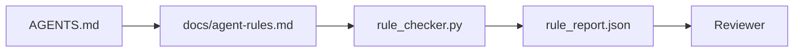

# 将智能体指令转化为可执行约束

> 以散文形式书写的指令是愿望。以约束形式书写的指令是测试。工作台将每条规则转化为智能体可在运行时检查的内容，以及审查者可在事后验证的依据。

**类型：** 构建
**语言：** Python（标准库）
**前置条件：** 第14阶段 · 32（最小工作台）
**时间：** 约50分钟

## 学习目标

- 将路由性散文与操作规则分离。
- 将启动规则、禁止行为、完成定义、不确定性处理和审批边界表达为机器可检查的约束。
- 实现一个规则检查器，根据规则集对一次运行进行评分。
- 使规则集便于差异比较，以便审查者能看到变更内容。

## 问题所在

典型的 `AGENTS.md` 读起来像入职文档。它告诉智能体要"仔细"、"彻底测试"、"不确定时要提问"。三天后，智能体推送了一个没有测试的更改，写入了禁止的目录，而且因为从不知道界限在哪里，所以从未提问过指令在具有操作性时才强大，在仅具有愿景性时则很薄弱。解决方法是编写工作台可以解释、审查者可以评分的规则。

## 核心概念

规则属于 `docs/agent-rules.md`，与简短的根路由器分开存放。每条规则都有一个名称、一个类别和一个检查点。



### 覆盖大多数规则的五个类别

| 类别 | 规则回答的问题 | 示例 |
|----------|---------------------------|---------|
| 启动 | 工作开始前必须满足什么条件？ | "状态文件存在且是新的" |
| 禁止 | 绝对不能发生什么？ | "不要编辑 `scripts/release.sh`" |
| 完成定义 | 什么能证明任务已完成？ | "pytest 退出码为 0 且验收行通过" |
| 不确定性 | 当智能体不确定时该怎么做？ | "创建一个问题说明而不是猜测" |
| 审批 | 什么需要人工批准？ | "任何新的依赖，任何对生产环境的写入" |

不符合这五个类别之一的规则，通常需要拆分为两条规则。请强制进行拆分。

### 规则可被机器读取

每条规则包含一个标识符、一个类别、一行描述以及一个 `check` 字段，该字段命名了 `rule_checker.py` 中的一个函数。添加一条规则意味着添加一个检查；检查器随着工作台一起增长。

### 规则便于差异比较

规则在单个Markdown文件中，每条规则占据一个独立的标题。重命名在差异中可见。新规则放在其所属类别的顶部。过时的规则直接删除而不是注释掉，因为工作台是唯一事实来源，而非团队上个季度感受的聊天记录。

### 规则与框架护栏

框架护栏（如 OpenAI Agents SDK 的护栏、LangGraph 的中断）在运行时层面强制执行规则。本课中的规则集是那些护栏所实现的、人类可读且可审查的契约。两者都需要：运行时在交互回合中捕获违规，规则集则证明运行时正在正确执行。

## 动手构建

`code/main.py` 包含：

- 一个将规则加载到数据类中的 `agent-rules.md` 解析器。
- 多个 `rule_checker.py` 风格检查器函数，每个对应一个 `check` 引用。
- 一个演示智能体运行，该运行违反了两条规则，以及一个能捕获这些违规的检查通过。

运行它：

```
python3 code/main.py
```

输出：已解析的规则集、运行轨迹、每条规则的通过/失败状态，以及一个保存在脚本旁的 `rule_report.json`。

## 生产环境中的模式

三种模式将一个能持续一个季度的规则集与一个一周内就失效的规则区分开来。

**在编写时标记严重性。** 每条规则都带有 `severity`：`block`、`warn` 或 `info`。检查器报告所有三类；运行时仅在出现 `block` 时拒绝。大多数团队在初期会高估严重性，然后在截止日期压力下悄悄降低；在编写时进行标记迫使一开始就进行校准。可与验证门（第14阶段 · 38）配对，它会将任何对 `block` 规则的覆盖签名到 `overrides.jsonl` 审计日志中。

**规则到期作为一种强制函数。** 每条规则都带有一个 `expires_at` 日期（默认为自编写之日起90天）。当一条未过期的规则连续60天没有出现违规时，检查器会发出警告；下一次季度审查要么证明保留它的合理性，要么将其降级为 `info`，要么将其删除。Cloudflare 的生产环境 AI 代码审查数据（2026年4月，30天内，跨越5,169个仓库的131,246次审查运行）显示，具有明确到期日的规则集每个仓库的规则数量保持在30条以下；没有到期日的规则集则增长到80条以上，其中大多数从未被触发。

**Markdown 作为源文件，JSON 作为缓存。** `agent-rules.md` 是编辑的文件；`agent-rules.lock.json` 是检查器在热路径中读取的缓存。锁文件由一个预提交钩子重新生成。Markdown 差异可审查；JSON 解析则不参与每个交互回合。这与 `package.json` / `package-lock.json` 以及 `Cargo.toml` / `Cargo.lock` 形状相同。

## 如何使用

在生产环境中：

- Claude Code、Codex、Cursor 在会话开始时读取规则，并在拒绝操作时引用它们。检查器在 CI 中重新运行这些规则以捕捉静默漂移。
- OpenAI Agents SDK 护栏将相同的检查注册为输入和输出护栏。Markdown 是文档表面；SDK 是运行时表面。
- LangGraph 的中断会在运行中的节点违反规则时触发。中断处理器读取规则，询问人类，然后继续执行。

该规则集在所有这三种场景中都是可移植的，因为它只是Markdown加上函数名。

## 如何交付

`outputs/skill-rule-set-builder.md` 会采访一个项目负责人，将他们现有的散文指令归类到五个类别中，并输出一个带版本号的 `agent-rules.md` 以及一个检查器存根。

## 练习

1. 如果你的产品确实需要，添加第六个类别。论证为什么它不能合并到五个类别中的一个。
2. 扩展检查器，使规则可以携带一个严重性级别（`block`、`warn`、`info`），报告据此进行聚合。
3. 将检查器接入 CI：如果最新智能体运行中出现一个阻止级别的规则失败，则构建失败。
4. 为每条规则添加一个“到期”字段。在90天内没有检查失败后，该规则需要被审查。
5. 找到一个真实的 `AGENTS.md`，并将其改写为五类别规则。其中有多少行是操作性的？多少是愿景性的？

## 关键术语

| 术语 | 人们怎么说 | 其实际含义 |
|------|----------------|------------------------|
| 操作规则 | "一条真正的指令" | 一条工作台可以在运行时检查的规则 |
| 理想化规则 | "要小心" | 一条没有检查的规则；要么删除，要么升级 |
| 完成定义 | "验收" | 任务完成的客观的、基于文件的证据 |
| 阻止严重性 | "硬规则" | 违规会中止运行；没有操作员干预无法静默 |
| 规则到期 | "过时规则清理" | 一条N天内没有失败的规则将进入退休审查 |

## 扩展阅读

- [OpenAI Agents SDK 护栏](https://platform.openai.com/docs/guides/agents-sdk/guardrails)
- [LangGraph 中断](https://langchain-ai.github.io/langgraph/how-tos/human_in_the_loop/breakpoints/)
- [Anthropic, 构建有效的智能体](https://www.anthropic.com/research/building-effective-agents)
- [Rick Hightower, Agent RuleZ: 一个确定性策略引擎](https://medium.com/@richardhightower/agent-rulez-a-deterministic-policy-engine-for-ai-coding-agents-9489e0561edf) — 生产环境中的阻止/警告/信息严重性
- [Cloudflare, 大规模编排 AI 代码审查](https://blog.cloudflare.com/ai-code-review/) — 13.1万次审查运行，规则组合经验
- [microservices.io, GenAI 开发平台 — 第1部分：护栏](https://microservices.io/post/architecture/2026/03/09/genai-development-platform-part-1-development-guardrails.html) — 规则与 CI 之间的纵深防御
- [类型检查的合规性：确定性护栏 (arXiv 2604.01483)](https://arxiv.org/pdf/2604.01483) — Lean 4 作为规则即检查的上限
- [logi-cmd/agent-guardrails](https://github.com/logi-cmd/agent-guardrails) — 合并门实现：作用域、变异测试、违规预算
- 第14阶段 · 32 — 本规则集所基于的最小工作台
- 第14阶段 · 38 — 消费规则报告的验证门
- 第14阶段 · 39 — 对规则合规性进行评分的审查者智能体