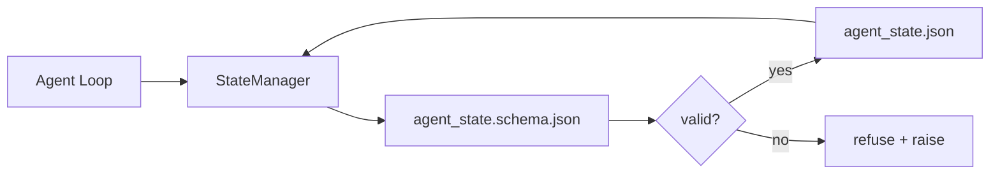

# 仓库记忆与持久化状态

> 聊天历史是易失的，而仓库是持久的。工作台将代理状态存储在版本化文件中，使得下一个会话、下一个代理和下一个审阅者都从同一个真相源读取数据。

**类型：** 构建
**语言：** Python（标准库 + `jsonschema` 可选）
**前置条件：** 阶段 14 · 32（最小工作台）
**时间：** 约 60 分钟

## 学习目标

- 定义哪些内容属于仓库记忆，哪些属于聊天历史。
- 为 `agent_state.json` 和 `task_board.json` 编写 JSON Schema。
- 构建一个状态管理器，能够原子地加载、验证、修改和持久化状态。
- 使用模式在数据损坏工作台之前拒绝无效的写入。

## 问题所在

代理完成了一个会话，聊天关闭了。下一个会话开启并询问从哪里开始。模型说“让我检查一下文件”，读取了过时的笔记，并重复了已经完成的工作。或者更糟，它重写了一个已完成的文件，因为没人告诉它这个文件已经完成了。

工作台的解决方案是仓库记忆：状态存储在仓库的 JSON 文件中，遵循模式写入，原子性地持久化，在代码审查中便于比较差异。聊天是一个临时的数据流；仓库才是系统的权威记录。

## 概念



### 什么属于仓库记忆

| 属于仓库记忆 | 不属于仓库记忆 |
|--------------|----------------|
| 当前活动的任务 ID | 原始聊天记录 |
| 本次会话修改过的文件 | Token 级别的推理轨迹 |
| 代理做出的假设 | “用户似乎很沮丧” |
| 未解决的阻塞项 | 采样的补全结果 |
| 下一步行动 | 供应商特定的模型 ID |

判断标准是持久性：三个月后在 CI 重跑时，这个信息还有用吗？如果是，就放仓库；如果不是，放遥测数据。

### 模式优先的状态

JSON Schema 是契约。没有它，每个代理都会发明新字段，每个审阅者都要学习新的结构，每个 CI 脚本都必须特殊处理旧版本。有了它，无效的写入就是被拒绝的写入。

该模式涵盖：

- 必需的键。
- 允许的 `status` 值。
- 禁止的值（例如数组的 `null`）。
- 模式约束（任务 ID 匹配 `T-\d{3,}`）。
- 用于迁移的版本字段。

### 原子写入

状态写入需要在部分失败的情况下幸存：先写入临时文件，fsync，然后原子重命名覆盖目标文件。状态文件是权威记录；一个写了一半的文件比没有文件还糟糕。

### 迁移

当模式发生更改时，在版本号升级的同时提供一个迁移脚本。状态文件包含一个 `schema_version` 字段；管理器拒绝加载它无法迁移的旧版本文件。

## 构建它

`code/main.py` 实现了：

- `agent_state.schema.json` 和 `task_board.schema.json`。
- 一个仅使用标准库的验证器（JSON Schema 子集：必需、类型、枚举、模式、项）。
- `StateManager.load`、`StateManager.update`、`StateManager.commit`，采用原子性的“临时-重命名”写入。
- 一个演示，修改状态、持久化、重新加载，并证明往返操作的正确性。

运行它：

```
python3 code/main.py
```

该脚本写入 `workdir/agent_state.json` 和 `workdir/task_board.json`，在两个步骤中修改它们，并在每一步打印经过验证的状态。

## 实际生产中的模式

有四种模式可以将本课的最小化实现转变为多代理单仓库能够生存的方案。

**原子“临时-重命名”写入不是可选的。** 2026 年 3 月的 Hive 项目错误报告清晰地记录了失败模式：`state.json` 通过 `write_text()` 写入，异常被捕捉并静默处理。部分写入导致会话在没有信号的情况下基于损坏的状态恢复。解决方案始终是：在目标文件所在目录创建 `tempfile.mkstemp`，写入，`fsync`，`os.replace`（在 POSIX 和 Windows 上均为原子重命名）。本课的 `atomic_write` 正是这样做的。

**对每个非幂等的工具调用使用幂等键。** 如果代理在调用工具后、记录结果前崩溃，恢复过程会重试该工具调用。这对读操作是安全的；但对发送邮件、数据库插入、文件上传等操作则是危险的。模式是：在执行前将每个工具调用 ID 记录到 `pending_calls.jsonl`。重试时，检查 ID；如果存在，则跳过调用并使用缓存的结果。Anthropic 和 LangChain 都在 2026 年的指南中强调了这一点；LangGraph 的检查点持久化器也出于相同原因挂起待处理的写入。

**将大型构件与状态分离。** 不要将 CSV、长对话记录或生成的文件存储在 `agent_state.json` 中。将构件保存为单独的文件（或上传到对象存储），并在状态中仅保留路径。检查点保持小而快；构件则独立增长。

**事件溯源用于审计，快照用于恢复。** 在每次修改时追加到事件日志（`state.events.jsonl`）；定期生成快照到 `state.json`。恢复时读取快照，然后重放快照时间戳之后的所有事件。这会消耗更多磁盘空间，但允许你逐字重放代理的决策——在调试长时间运行的任务时至关重要。Postgres 内部用于 WAL 的也是相同的架构。

**模式迁移或拒绝加载。** `schema_version` 整数就是契约。当管理器加载一个未知版本的文件时，它会拒绝读取。在模式升级的同时提供一个迁移脚本；`tools/migrate_state.py` 在每次启动时幂等地运行。

## 应用它

在生产环境中：

- **LangGraph 检查点持久化器。** 相同的想法，不同的存储。检查点持久化器将图状态持久化到 SQLite、Postgres 或自定义后端。本课教授的模式是在检查点持久化器失效、你需要手动读取状态时会用到的。
- **Letta 记忆块。** 带有结构化模式的持久化块（阶段 14 · 08）。相同的规范适用于长时间运行的人格。
- **OpenAI Agents SDK 会话存储。** 可插拔的后端，模式感知。本课的状态文件是本地文件后端。

## 交付它

`outputs/skill-state-schema.md` 生成一个项目特定的 JSON Schema 对（状态 + 看板），一个连接到原子写入的 Python `StateManager`，以及一个迁移脚手架，以便下次模式升级不会破坏工作台。

## 练习

1.  添加一个 `last_human_touch` 时间戳。拒绝任何在人工编辑后五秒内的代理写入。
2.  扩展验证器以支持 `oneOf`，这样任务可以是具有不同必需字段的构建任务或审查任务。
3.  添加一个 `schema_version` 字段，并编写从 v1 到 v2 的迁移（将 `blockers` 重命名为 `risks`）。
4.  将存储后端从本地文件迁移到 SQLite。保持 `StateManager` API 不变。
5.  用 50 毫秒的写入竞争让两个代理操作同一个状态文件。会出现什么问题，原子重命名如何拯救你？

## 关键术语

| 术语 | 人们怎么说 | 实际含义 |
|------|------------|----------|
| 仓库记忆 | “笔记文件” | 存储在仓库中已跟踪文件中的状态，遵循模式 |
| 模式优先 | “验证输入” | 在写入器之前定义契约，拒绝漂移 |
| 原子写入 | “就是重命名” | 写入临时文件，fsync，重命名，这样部分失败就不会导致损坏 |
| 迁移 | “模式升级” | 将 vN 状态转换为 v(N+1) 状态的脚本 |
| 权威记录 | “真相源” | 工作台视为权威的构件 |

## 延伸阅读

- [JSON Schema 规范](https://json-schema.org/specification.html)
- [LangGraph 检查点持久化器](https://langchain-ai.github.io/langgraph/concepts/persistence/)
- [Letta 记忆块](https://docs.letta.com/concepts/memory)
- [Fast.io, AI 代理状态检查点：实践指南](https://fast.io/resources/ai-agent-state-checkpointing/) —— 带幂等性的模式优先检查点
- [Fast.io, AI 代理工作流状态持久化：2026 年最佳实践](https://fast.io/resources/ai-agent-workflow-state-persistence/) —— 并发控制、TTL、事件溯源
- [Hive Issue #6263 — 非原子 state.json 写入被静默忽略](https://github.com/aden-hive/hive/issues/6263) —— 真实项目中的失败模式
- [eunomia, 检查点/恢复系统：演进、技术、应用](https://eunomia.dev/blog/2025/05/11/checkpointrestore-systems-evolution-techniques-and-applications-in-ai-agents/) —— 来自操作系统历史的 CR 原语应用于代理
- [Indium, 2026 年长时间运行 AI 代理的 7 种状态持久化策略](https://www.indium.tech/blog/7-state-persistence-strategies-ai-agents-2026/)
- [Microsoft Agent Framework, 压缩](https://learn.microsoft.com/en-us/agent-framework/agents/conversations/compaction) —— 供应商检查点管理器
- 阶段 14 · 08 —— 记忆块与睡眠时间计算
- 阶段 14 · 32 —— 本课将其模式化的三文件最小化
- 阶段 14 · 40 —— 从同一模式读取的移交包