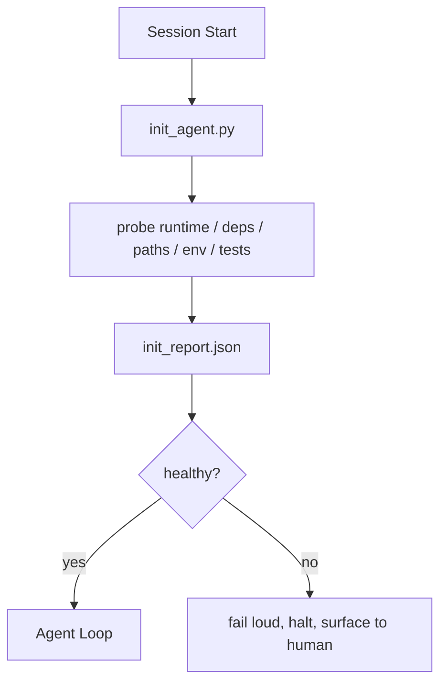

# 智能体的初始化脚本

> 每次冷启动会话都会产生额外开销。智能体需要重复读取相同文件、重新尝试相同的探测路径、重新发现相同的路径结构。一个初始化脚本能一次性完成这些工作，并将结果写入状态中。

**类型：** 构建
**语言：** Python（标准库）
**前置要求：** 阶段14 · 32（最小工作台），阶段14 · 34（仓库记忆）
**时间：** 约45分钟

## 学习目标

- 识别智能体在单次会话中无需重复执行的工作。
- 构建一个确定性初始化脚本，用于探测运行时环境、依赖项和仓库状态。
- 将探测结果持久化，以便智能体直接读取而非重新运行检查。
- 确保初始化失败时能够清晰、快速地报错，并提供统一的排查入口。

## 问题所在

开启会话时，智能体需要猜测Python版本、猜测测试命令、多次列出仓库根目录以找到入口点、尝试导入未安装的包、向用户询问配置文件位置。在它能够真正开始编辑工作之前，大量token已经消耗在本应由单个脚本完成的环境配置任务上。

解决方案是使用一个初始化脚本，在智能体执行任何操作前运行，并将结果写入`init_report.json`文件供智能体启动时读取。

## 核心概念



### 初始化脚本的探测内容

| 探测项 | 重要性说明 |
|--------|------------|
| 运行时版本 | 错误的Python或Node版本会导致难以察觉的版本兼容性问题 |
| 依赖可用性 | 后期发现依赖缺失的代价是现在检查的十倍 |
| 测试命令 | 智能体必须知道如何验证；如果命令缺失，说明工作台已损坏 |
| 仓库路径 | 硬编码路径容易漂移；一次性解析并固定 |
| 环境变量 | 缺失`OPENAI_API_KEY`是故障点而非运行时谜题 |
| 状态+看板新鲜度 | 崩溃会话的过时状态是隐患 |
| 最后已知正常提交 | 为会话结束时的交接差异提供锚点 |

### 清晰报错、快速失败、统一入口

探测失败意味着立即停止并向用户报告。不要试图让智能体“自行处理”。初始化的核心目的就是当工作台损坏时拒绝启动。

### 幂等性

连续运行两次脚本，第二次运行除更新时间戳外不应产生其他操作。幂等性使得脚本可以集成到CI、钩子或任务前斜杠命令中。

### 初始化与启动规则

规则（阶段14 · 33）描述了执行操作前必须满足的条件。初始化脚本正是建立这些规则可被检查的基础。没有初始化的规则只是“请小心”。没有规则的初始化只是精美的失败。

## 构建实现

`code/main.py`实现了`init_agent.py`：

- 五项探测：Python版本、通过`importlib.util.find_spec`检查列出的依赖、测试命令可解析性、必需环境变量、状态文件新鲜度。
- 每项探测返回`(name, status, detail)`。
- 脚本将完整探测集写入`init_report.json`，如果任何关键严重性探测失败则以非零值退出。

运行命令：

```
python3 code/main.py
```

脚本会打印探测结果表格，写入`init_report.json`文件，在正常路径下以零值退出，或在探测失败时以非零值退出并列出失败项。

## 实践中的生产模式

三个模式将实用的初始化脚本与表面工程区分开来。

**最后已知正常提交锚定。** 将当前提交与上次成功合并时写入的`LKG`文件进行比较。如果差异超过阈值（默认50个文件），则拒绝启动并要求人工确认新的基线。这是Cloudflare AI代码审查用来界定审查智能体范围的方式：每个审查会话都锚定到相同的最后已知正常状态，避免跨会话漂移累积。

**带TTL的锁文件。** 首次成功通过探测后写入`prereqs.lock`文件。后续运行在N小时（默认24小时）内信任该锁文件并跳过昂贵的探测。初始化脚本会首先读取锁文件；如果锁文件新鲜且依赖清单哈希匹配，则快速通过。这与Docker层缓存的模式相同：幂等探测+内容哈希=跳过。

**热路径中无网络、无LLM、无意外。** 初始化探测是确定性的基础流程。如果一个探测需要调用LLM来分类故障或访问外部服务检查许可证，那它就不是探测而是工作流。如果探测在空运行时超过三秒，这应被视为工作台缺陷，要么将其移出初始化流程，要么缓存其结果。

## 生产环境使用

- **Claude Code钩子。** `pre-task`钩子调用初始化脚本，失败时拒绝启动智能体。
- **GitHub Actions。** `setup-agent`任务运行初始化脚本；智能体任务依赖于它。
- **Docker入口点。** 智能体容器在exec启动智能体运行时前运行初始化脚本；失败时记录日志。

初始化脚本具有可移植性，因为它不调用特定框架。Bash、Make或任务文件都可以封装它。

## 交付方案

`outputs/skill-init-script.md`分析项目，将其设置工作分类为探测项，并生成项目特定的`init_agent.py`文件以及在智能体步骤前运行它的CI工作流。

## 练习

1. 添加一个探测项，比较当前提交与最后已知正常提交的差异，如果变更超过50个文件则拒绝启动。
2. 脚本写入`prereqs.lock`文件，如果锁文件超过七天则拒绝启动。
3. 添加`--fix`标志，自动安装缺失的开发依赖但不修改运行时依赖（除非获得批准）。
4. 将探测从硬编码函数移到YAML注册表。分析这种权衡的利弊。
5. 为每项探测添加时间预算。超过三秒的探测应被视为工作台缺陷。

## 关键术语

| 术语 | 常见说法 | 实际含义 |
|------|----------|----------|
| 探测 | “检查” | 返回`(name, status, detail)`的确定性函数 |
| 初始化报告 | “设置输出” | 写在状态文件旁的JSON，包含探测结果 |
| 幂等 | “可安全重复运行” | 连续两次运行产生相同的报告（时间戳除外） |
| 清晰报错 | “不要吞掉错误” | 立即停止并向用户报告；无静默回退 |
| 设置开销 | “启动成本” | 智能体会话中用于重新发现明显信息的token消耗 |

## 扩展阅读

- [Anthropic，长运行智能体的有效控制机制](https://www.anthropic.com/engineering/effective-harnesses-for-long-running-agents)
- [GitHub Actions，用于设置的复合操作](https://docs.github.com/en/actions/sharing-automations/creating-actions/creating-a-composite-action)
- [microservices.io，GenAI开发平台：防护栏](https://microservices.io/post/architecture/2026/03/09/genai-development-platform-part-1-development-guardrails.html) — 提交前+CI检查作为初始化
- [Augment Code，如何构建你的AGENTS.md（2026）](https://www.augmentcode.com/guides/how-to-build-agents-md) — 初始化预期
- [Codex博客，Codex CLI上下文压缩](https://codex.danielvaughan.com/2026/03/31/codex-cli-context-compaction-architecture/) — 会话启动作为压缩感知初始化
- 阶段14 · 33 — 此脚本启用的规则集
- 阶段14 · 34 — 此脚本初始化的状态文件
- 阶段14 · 38 — 初始化脚本提供的验证门
- 阶段14 · 40 — 消费初始化报告最后已知正常提交的交接流程