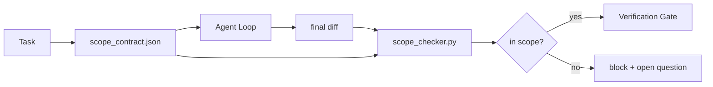

# 范围合约与任务边界

> 模型并不清楚工作何时结束。范围合约是一个按任务生成的文件，它定义了工作的起止界限，以及当工作溢出时如何回滚。该合约将“保持范围”从一项愿望变成了可验证的检查。

**类型:** 构建
**语言:** Python（标准库）
**前置条件:** Phase 14 · 32 (最小工作台)，Phase 14 · 33 (规则即约束)
**时长:** ~50 分钟

## 学习目标

- 编写一份范围合约，供智能体在任务开始时读取，供验证器在任务结束时读取。
- 指定允许的文件、禁止的文件、验收标准、回滚计划和审批边界。
- 实现一个范围检查器，将差异与合约进行比对并标记违规。
- 使范围蔓延可见、自动且可审查。

## 问题所在

智能体会悄悄扩大范围。任务是“修复登录错误”。但生成的差异却触及了登录路由、邮件助手、数据库驱动、README 和发布脚本。每个修改在当下都有合理理由。但综合起来，它们构成了一个与原本审查范围不同的变更。

范围蔓延是智能体工作中最被忽视的失效模式，因为智能体总是真诚地叙述其每个步骤。解决之道不是更严格的提示。解决之道在于一份存储在磁盘上的、说明了承诺内容的合约，以及一个将结果与承诺进行比对的检查。

## 核心概念



### 范围合约的构成

| 字段 | 用途 |
|-------|---------|
| `task_id` | 链接到任务看板上的任务 |
| `goal` | 供审查者验证的一句话描述 |
| `allowed_files` | 智能体可以写入的文件通配符（Globs）列表 |
| `forbidden_files` | 智能体绝不允许碰触（即使意外）的文件通配符列表 |
| `acceptance_criteria` | 用于证明任务完成的测试命令或断言行 |
| `rollback_plan` | 当需要中止时，操作员可执行的一段操作指南 |
| `approvals_required` | 需要明确人类批准的、超出范围的操作 |

一份缺少 `forbidden_files` 的合约是不完整的。这个“否定空间”占据了合约的一半。

### 使用通配符，而非原始路径

真实的代码库会移动文件。将合约绑定到文件通配符 (`app/**/*.py`, `tests/test_signup*.py`) 上，这样一次跨会话的重构就不会使合约失效。

### 回滚是范围的一部分

列出如何回滚会迫使合约作者思考可能出错的地方。一个你无法回滚的合约，就是一个不应该被批准的合约。

### 范围检查即差异检查

智能体生成一份差异。检查器读取该差异、允许的通配符列表、禁止的通配符列表，以及任何已运行的验收命令列表。每一个违规点都会被打上标签，验证门禁可以据此拒绝。

## 构建实现

`code/main.py` 实现了：

- `scope_contract.json` schema（JSON Schema 的一个子集，包含 glob 数组）。
- 一个差异解析器，它将修改过的文件列表和运行过的命令列表转换成一个 `RunSummary`。
- 一个 `scope_check`，它返回相对于合约的 `(violations, in_scope, off_scope)`。
- 两个演示运行：一个在范围内，一个发生蔓延。检查器会准确地指出蔓延发生的文件及原因。

运行它：

```
python3 code/main.py
```

输出：合约、两次运行的结果、每次运行的判定结果，以及一个保存的 `scope_report.json`。

## 生产环境中的实践模式

一位实践者报告，在调用智能体前采用“规格最大化”（在 YAML 中编写范围合约），三周内兔子洞（方向迷失）的发生率从 52% 降至 21%，且未更改智能体本身。是合约在起作用，而非模型。有三种模式确保了收益的稳固。

**设定违规预算，而非二元失败。** `agent-guardrails`（Claude Code、Cursor、Windsurf、Codex 通过 MCP 使用的开源合并门禁）为每个任务提供了一个 `violationBudget`：预算内的轻微范围滑移会作为警告浮出水面；只有当预算超支时，合并门禁才会拒绝。将其与 `violationSeverity: "error" | "warning"` 配对使用。预算是“一个能顺利通过的门禁”与“一个因团队厌恶而被禁用的门禁”之间的区别。

**按路径家族划分严重性不对称。** 对 `docs/**` 的超范围写入通常是 `warn`；而对 `scripts/**`、`migrations/**`、`config/prod/**` 的超范围写入则始终是 `block`。这种不对称性必须存在于合约中，而非运行时，因为它是项目特定的，并且会随任务而变化。

**在文件预算旁设置时间和网络预算。** 一个 `time_budget_minutes` 字段限制了挂钟时间；运行时在未经重新批准的情况下，超时后将拒绝继续执行。一个 `network_egress` 主机名允许列表可以防止智能体悄悄访问不属于任务的外部 API。这些也是范围维度；文件通配符是必要的，但不是充分的。

**多合约合并语义（最小权限原则）。** 当两个范围合约同时适用时（例如，一个项目全局合约加上一个任务特定合约），其合并规则为：**取交集** `allowed_files`（两个合约都必须允许该路径）、**取并集** `forbidden_files`（任一合约可禁止），`time_budget_minutes` 取最严格限制（最小值），`approvals_required` 累加。`network_egress` 表示 `None`（不强制执行）、`[]`（全部拒绝），`[...]` 作为允许列表；在合并下，`None` 会服从另一方，两个列表取交集，全部拒绝则保持全部拒绝。在合约模式中说明这一点，使合并操作成为机械且可审查的。

## 如何使用

生产模式：

- **Claude Code 斜杠命令。** `/scope` 命令编写合约并将其固定为会话上下文。子智能体在行动前会读取该合约。
- **GitHub PRs。** 将合约作为 JSON 文件推送到 PR 描述中，或作为签入的构建产物。CI 会针对合并差异运行范围检查器。
- **LangGraph 中断。** 范围违规会触发一个中断；处理器会询问人类，是需要扩大合约范围，还是需要智能体回退。

合约随任务而行。当任务关闭时，合约会存档在 `outputs/scope/closed/` 下。

## 发布它

`outputs/skill-scope-contract.md` 为任务描述生成一份范围合约，以及一个可在 CI 中针对每个智能体差异运行的、支持通配符的检查器。

## 练习

1. 添加一个 `network_egress` 字段，列出允许的外部主机。拒绝运行中触及了其他主机的情况。
2. 扩展检查器，使其在 `docs/**` 上“软失败”（警告），在 `scripts/**` 上“硬失败”（拒绝）。解释这种不对称性的理由。
3. 让合约根据一个 `goal` 字段，使用一组静态规则（无 LLM）推导出 `allowed_files`。在第一个边缘情况时会出现什么问题？
4. 添加一个 `time_budget_minutes`，并在挂钟时间超过该值后拒绝继续。
5. 对同一个差异运行两个合约。当两者都适用时，正确的合并语义是什么？

## 关键术语

| 术语 | 人们常说 | 它的真正含义 |
|------|----------------|------------------------|
| 范围合约 | “任务简报” | 按任务划分的 JSON 文件，列出了允许/禁止的文件、验收标准、回滚计划 |
| 范围蔓延 | “它还碰了…” | 在同一任务中修改了合约范围之外的文件 |
| 回滚计划 | “我们可以回退” | 操作员在需要中止时执行的一段操作手册 |
| 审批边界 | “需要签字同意” | 合约中列出的需要明确人类批准的操作 |
| 差异检查 | “路径审计” | 将修改过的文件与合约中的通配符进行比对 |

## 延伸阅读

- [LangGraph 人在环中断](https://langchain-ai.github.io/langgraph/concepts/human_in_the_loop/)
- [OpenAI 智能体 SDK 工具审批策略](https://platform.openai.com/docs/guides/agents-sdk)
- [logi-cmd/agent-guardrails — 合并门禁与范围验证](https://github.com/logi-cmd/agent-guardrails) — 违规预算、严重性等级
- [Dev|Journal, 使用智能体合约测试防止 AI 智能体配置漂移](https://earezki.com/ai-news/2026-05-05-i-built-a-tiny-ci-tool-to-keep-ai-agent-configs-from-drifting-in-my-repo/) — 无外部依赖的 `--strict` 模式
- [智能体编码不是陷阱（生产日志）](https://dev.to/jtorchia/agentic-coding-is-not-a-trap-i-answered-the-viral-hn-post-with-my-own-production-logs-33d9) — 规格最大化实例：52% → 21%
- [OpenCode 权限通配符](https://opencode.ai/docs/agents/) — 细粒度的按权限范围划分
- [Knostic, AI 编码智能体安全：威胁模型与防护策略](https://www.knostic.ai/blog/ai-coding-agent-security) — 范围作为最小权限的一部分
- [Augment Code, AI 规格模板](https://www.augmentcode.com/guides/ai-spec-template) — 三级边界系统（必须/询问/绝不）
- Phase 14 · 27 — 与范围锁配合使用的提示注入防御
- Phase 14 · 33 — 本合约按任务具体化的规则集
- Phase 14 · 38 — 检查器报告到的验证门禁