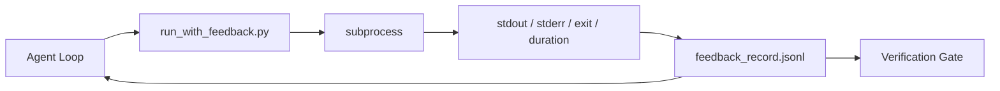

# 运行时反馈循环

> 看不到真实命令输出的代理会进行猜测。一个反馈运行器会捕获标准输出、标准错误、退出码和执行时间，形成结构化记录，供下一次迭代读取。这样，代理就能基于事实而非对事实的预测做出反应。

**类型：** 构建
**语言：** Python（标准库）
**前置条件：** 阶段 14 · 32（最小工作台），阶段 14 · 35（初始化脚本）
**时间：** ~50 分钟

## 学习目标

- 区分运行时反馈与可观测性遥测。
- 构建一个包装 shell 命令并持久化结构化记录的反馈运行器。
- 确定性地截断大型输出，以便循环保持在 token 预算内。
- 当反馈缺失时，拒绝推进循环。

## 问题所在

代理说“正在运行测试”。下一条消息说“所有测试通过”。而现实是，根本没有运行任何测试。代理凭空想象了输出，或者它运行了命令但从未读取结果，或者它读取了结果但默默地截断了失败行。

反馈运行器消除了这个差距。每个命令都通过运行器执行。每条记录都携带命令、捕获的标准输出和标准错误、退出码、墙钟时间以及代理的一行注释。代理在下一次迭代中读取该记录。验证门在任务结束时读取记录。

## 核心概念



### 反馈记录包含什么

| 字段 | 重要性说明 |
|------|-----------|
| `command` | 精确的 argv，无 shell 扩展意外 |
| `stdout_tail` | 最后 N 行，确定性截断 |
| `stderr_tail` | 最后 N 行，与标准输出分离 |
| `exit_code` | 明确的成功信号 |
| `duration_ms` | 暴露缓慢探测和失控进程 |
| `started_at` | 用于重放的时间戳 |
| `agent_note` | 代理对其预期内容的一行描述 |

### 截断是确定性的

一个 50 MB 的日志会毁掉循环。运行器使用 `...truncated N lines...` 标记进行头部和尾部截断，具有确定性，因此相同的输出总是产生相同的记录。没有采样；代理需要看到的部分（最终错误、最终摘要）位于尾部。

### 反馈与遥测

遥测（阶段 14 · 23，OTel GenAI 约定）供人工操作员跨时间审查运行。反馈则供本次运行的下一次迭代使用。它们共享字段，但存在于不同的文件中，具有不同的保留策略。

### 缺少反馈时拒绝推进

如果运行器在捕获退出码前出错，记录将携带 `exit_code: null` 和 `error: <reason>`。代理循环必须拒绝在 `null` 退出码的情况下声称成功。没有退出码，就没有进展。

## 构建它

`code/main.py` 实现了：

- `run_with_feedback(command, agent_note)` 包装了 `subprocess.run`，捕获标准输出/标准错误/退出码/执行时间，确定性地截断，并追加到 `feedback_record.jsonl`。
- 一个将 JSONL 文件流式加载到 Python 列表的小型加载器。
- 一个运行三个命令（成功、失败、慢速）并打印每个命令最后一条记录的演示。

运行它：

```
python3 code/main.py
```

输出：三条反馈记录追加到 `feedback_record.jsonl`，每个命令的最后一条内联打印。在重新运行时跟踪文件，可以看到循环如何累积。

## 生产环境中的实用模式

三种模式可以加固运行器以便部署。

**写入时编辑，而非读取时编辑。** 任何涉及标准输出或标准错误的记录都可能泄露密钥。运行器在 JSONL 追加前执行编辑操作：删除匹配 `^Bearer `、`password=`、`api[_-]?key=`、`AKIA[0-9A-Z]{16}`（AWS）、`xox[baprs]-`（Slack）的行。读取时编辑是自找麻烦；磁盘上的文件才是攻击者能触及的地方。每季度根据生产运行时观察到的密钥格式审计编辑模式。

**轮换策略，而非单个文件。** 将 `feedback_record.jsonl` 的上限设为每个文件 1 MB；溢出时轮换到 `.1`、`.2`，丢弃 `.5`。代理的循环只读取当前文件，因此运行时成本是有界的。CI 制品存储获得完整的轮换集。没有轮换，文件将成为每次加载调用的瓶颈。

**父命令 ID 用于重试链。** 每条记录获得 `command_id`；重试携带指向先前尝试的 `parent_command_id`。审查器的“失败尝试”列表（阶段 14 · 40）和验证门的审计都遵循此链。没有此链接，重试看起来像独立的成功，审计会隐藏失败历史。

## 使用它

生产环境模式：

- **Claude Code Bash 工具。** 该工具已经捕获标准输出、标准错误、退出码和执行时间。本课中的运行器是适用于任何代理产品的框架无关等效实现。
- **LangGraph 节点。** 用运行器包装任何 shell 节点，以便记录在图状态之外持久化。
- **CI 日志。** 将 JSONL 导入到 CI 制品存储；审查器可以重放任何命令而无需重新运行会话。

运行器是一个轻量级包装器，能承受任何框架迁移，因为它拥有记录的结构。

## 部署它

`outputs/skill-feedback-runner.md` 生成一个项目特定的 `run_with_feedback.py`，包含正确的截断预算、连接到工作台的 JSONL 写入器，以及代理在每次迭代时读取的加载器。

## 练习

1.  为每条记录添加一个 `cwd` 字段，以便区分从不同目录运行的相同命令。
2.  添加一个 `redaction` 步骤，用于删除匹配 `^Bearer ` 或 `password=` 的行。在一个固定记录上进行测试。
3.  通过轮换到 `.1`、`.2` 文件，将总 `feedback_record.jsonl` 大小限制在 1 MB。为轮换策略辩护。
4.  添加一个 `parent_command_id`，以便重试链可见：哪个命令产生了下一个命令所消费的输入。
5.  将 JSONL 导入一个小型 TUI，以突出显示最新的非零退出码。TUI 必须显示的八项关键功能，才能在审查中有用。

## 关键术语

| 术语 | 常见说法 | 实际含义 |
|------|---------|---------|
| 反馈记录 | “运行日志” | 包含命令、输出、退出码、执行时间的结构化 JSONL 条目 |
| 尾部截断 | “修剪日志” | 确定性的头部+尾部捕获，使记录适合 token 预算 |
| 空值拒绝 | “缺少数据时阻塞” | 当 `exit_code` 为空时，循环不得推进 |
| 代理注释 | “预期标签” | 代理在读取结果前写下的预测性一行描述 |
| 遥测分离 | “两个日志文件” | 反馈用于下一次迭代，遥测用于操作员 |

## 延伸阅读

- [OpenTelemetry GenAI 语义约定](https://opentelemetry.io/docs/specs/semconv/gen-ai/)
- [Anthropic，长期运行代理的有效框架](https://www.anthropic.com/engineering/effective-harnesses-for-long-running-agents)
- [Guardrails AI x MLflow — 确定性安全、PII、质量验证器](https://guardrailsai.com/blog/guardrails-mlflow) — 作为回归测试的编辑模式
- [Aport.io，2026 年最佳 AI 代理护栏：预操作授权对比](https://aport.io/blog/best-ai-agent-guardrails-2026-pre-action-authorization-compared/) — 工具前/后捕获
- [Andrii Furmanets，2026 年的 AI 代理：工具、记忆、评估、护栏的实用架构](https://andriifurmanets.com/blogs/ai-agents-2026-practical-architecture-tools-memory-evals-guardrails) — 可观测性界面
- 阶段 14 · 23 — 遥测方面的 OTel GenAI 约定
- 阶段 14 · 24 — 代理可观测性平台（Langfuse, Phoenix, Opik）
- 阶段 14 · 33 — 要求完成前必须有反馈的规则
- 阶段 14 · 38 — 读取 JSONL 的验证门