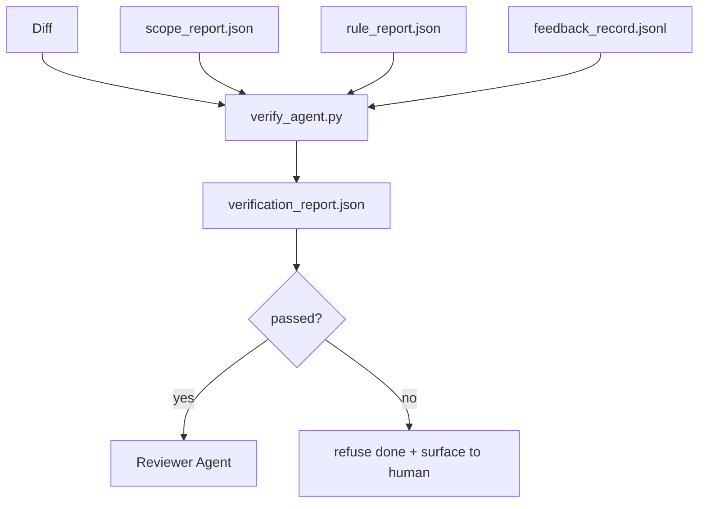

# 验证门

> 智能体不能自行将工作标记为完成。验证门会读取范围契约、反馈日志、规则报告和差异文件，并回答一个核心问题：此任务是否真正完成？如果验证门的答案是“否”，则无论对话如何描述，任务均未完成。

**类型：** 构建
**语言：** Python（标准库）
**前置要求：** 阶段 14 · 33（规则），阶段 14 · 36（范围），阶段 14 · 37（反馈）
**时间：** 约 55 分钟

## 学习目标

- 将验证门定义为针对工作台产物的确定性函数。
- 将规则报告、范围报告、反馈记录和差异文件综合为一个单一裁决。
- 发出一个审查智能体和持续集成系统都能读取的 `verification_report.json`。
- 对于任何阻断级别的错误，绝不推进任务，无一例外。

## 问题所在

智能体过早地宣布成功。三种失败模式尤为突出：

- “看起来不错。” 模型阅读了自己的差异文件，并判断它是正确的。
- “测试通过。” 说得很自信，但没有实际运行测试的记录。
- “需求已满足。” 对验收标准的解释足够宽松，以至于“任何看似完成的东西”都算数。

工作台的解决方案是设立一个单一的验证门，它读取智能体已产出的产物并做出判断。验证门是确定性的。验证门受版本控制。验证门接入持续集成。智能体无法贿赂它。

## 核心概念



### 验证门的检查项

| 检查项 | 来源产物 | 严重级别 |
|-------|-----------------|----------|
| 所有验收命令已运行 | `feedback_record.jsonl` | 阻断 |
| 所有验收命令返回码为零 | `feedback_record.jsonl` | 阻断 |
| 范围检查无禁止写入 | `scope_report.json` | 阻断 |
| 范围检查无超范围写入 | `scope_report.json` | 阻断或警告 |
| 所有阻断级别规则通过 | `rule_report.json` | 阻断 |
| 反馈中无 `null` 退出码 | `feedback_record.jsonl` | 阻断 |
| 涉及文件与 `scope.allowed_files` 匹配 | 两者皆有 | 警告 |

`warn` 类别的发现会为裁决附加注释；`block` 类别的发现会阻止 `passed: true`。

### 确定性，而非概率性

验证门必须对同一组产物每次产生相同的裁决。不依赖大语言模型判断。大语言模型判断属于审查端（阶段 14 · 39），那里目标是定性评估，而非状态判定。

### 一份报告，一条路径

验证门在任务完成时发出一个 `verification_report.json`，写入 `outputs/verification/<task_id>.json` 路径下。持续集成系统也读取同一路径。多个验证门使用不同路径会分裂事实来源。

### 绝不妥协

阻断级别的发现不能被智能体覆盖。只能由人类通过记录 `override_reason` 和 `overridden_by` 用户标识来覆盖。覆盖是签名的操作，而非智能体的决定。

## 动手构建

`code/main.py` 实现：

- 一个用于加载每个输入产物的加载器，所有输入均在本地存根化，以便课程内容自包含。
- 一个 `verify(task_id, artifacts) -> VerdictReport` 纯函数。
- 一个显示各项检查结果及最终通过/失败状态的打印器。
- 一个包含三种任务场景的演示：顺利通过、范围蔓延、验收缺失。

运行它：

```
python3 code/main.py
```

输出：三份裁决报告，每份保存在脚本旁边。

## 生产环境中的实践模式

四种模式将验证门从“又一个检查任务”提升为“决定性的边界”。

**纵深防御，而非单一门控。** 预提交钩子 → 持续集成状态检查 → 工具授权前钩子 → 合并前门控。每一层都是确定性的，因此一层中的失败会被下一层捕获。microservices.io 的 2026 年 3 月手册明确指出：预提交钩子不可绕过，因为与模型端技能不同，它不依赖于智能体是否遵守指令。验证门位于持续集成 / 合并前层。

**通过确定性检查进行防御，大语言模型仅用于细节判断。** Anthropic 2026 年的混合规范配对：可验证的奖励（单元测试、模式检查、退出码）回答“代码是否解决了问题？” — 大语言模型评分标准回答“代码是否可读、安全、符合风格？” 验证门运行第一类；审查器（阶段 14 · 39）运行第二类。混合两者会混淆信号。

**签名覆盖日志，而非聊天记录。** 每次覆盖都在 `outputs/verification/overrides.jsonl` 中生成一行记录，包含：时间戳、发现代码、原因、签名用户、当前 HEAD 提交。运行时拒绝任何缺乏签名的覆盖；审计追踪由 git 跟踪。这是覆盖政策与覆盖表演之间的分界线。

**将覆盖率下限作为一等检查。** `coverage_report.json` 提供给一个 `coverage_floor`（默认 80%）检查。如果测量覆盖率低于下限或比上一次合并的覆盖率下限低超过 1 个百分点，验证门即失败。没有此检查，智能体会悄悄删除失败的测试，而验证报告仍然显示绿色。

**`--strict` 模式将警告提升为阻断。** 对于发布分支、阻碍发货的 PR 或事故后分诊，`--strict` 会使每个警告成为硬性失败。该标志是按分支选择启用的；并非全局默认，因为对所有事情都严格会侵蚀日常流程。

## 使用它

生产模式：

- **持续集成步骤。** 一个 `verify_agent` 作业针对智能体的最终产物运行验证门。合并保护在没有 `passed: true` 的情况下拒绝合并。
- **移交前钩子。** 智能体运行时在生成移交文档前调用验证门。无绿色裁决，无移交。
- **人工分诊。** 当智能体声称成功而人类表示怀疑时，操作员可以阅读报告。

验证门是工作台流程中的决定性边界。其他所有环节都位于其上游。

## 部署它

`outputs/skill-verification-gate.md` 将验证门接入特定项目：哪些验收命令为其提供输入，哪些规则是阻断级别，哪些超范围写入是允许的，覆盖审计日志如何存储。

## 练习

1.  添加一个 `coverage_floor` 检查：测试命令必须生成至少 80% 的覆盖率报告。决定由哪个产物承载该下限。
2.  支持一个 `--strict` 模式，将每个 `warn` 提升为 `block`。记录哪些情况下严格模式是正确的默认设置。
3.  使验证门除了 JSON 外，还生成 Markdown 摘要。论证哪些字段应包含在摘要中。
4.  添加一个 `time_since_last_human_touch` 检查：在人类击键后 60 秒内编辑的任何文件，均可豁免超范围标志。
5.  在你的产品中，针对一个真实的智能体差异运行验证门。有多少发现是真实的，有多少是噪音？验证门需要在哪里改进？

## 关键术语

| 术语 | 人们常说 | 实际含义 |
|------|----------------|------------------------|
| 验证门 | "阻止事情的检查" | 针对工作台产物产生通过/失败裁决的确定性函数 |
| 阻断级别 | "硬性失败" | 阻止 `passed: true` 且需要签名覆盖的发现 |
| 覆盖日志 | "我们为何放行" | 包含原因和用户标识的签名条目，经审查审计 |
| 验收命令 | "证据" | 一个 shell 命令，其返回码为零是 `done` 的含义 |
| 单一报告路径 | "事实来源" | `outputs/verification/<task_id>.json`，由持续集成系统和人类共同使用 |

## 延伸阅读

- [Anthropic, 长期运行应用开发的 Harness 设计](https://www.anthropic.com/engineering/harness-design-long-running-apps)
- [OpenAI Agents SDK 护栏](https://platform.openai.com/docs/guides/agents-sdk/guardrails)
- [microservices.io, GenAI 开发平台：护栏](https://microservices.io/post/architecture/2026/03/09/genai-development-platform-part-1-development-guardrails.html) — 预提交与持续集成之间的纵深防御
- [ICMD, 2026 年智能体 AI 运维手册](https://icmd.app/article/the-2026-playbook-for-agentic-ai-ops-guardrails-costs-and-reliability-at-scale-1776661990431) — 审批门梯度（草稿 → 审批 → 阈值下自动）
- [类型检查合规：确定性护栏（arXiv 2604.01483）](https://arxiv.org/pdf/2604.01483) — Lean 4 作为确定性门控的上限
- [logi-cmd/agent-guardrails — 合并门规范](https://github.com/logi-cmd/agent-guardrails) — 范围 + 变异测试门控
- [Guardrails AI x MLflow](https://guardrailsai.com/blog/guardrails-mlflow) — 确定性验证器作为持续集成评分器
- [Akira, 智能体系统的实时护栏](https://www.akira.ai/blog/real-time-guardrails-agentic-systems) — 工具前/后门控
- 阶段 14 · 27 — 提示注入防御（验证门的对抗方）
- 阶段 14 · 36 — 此验证门强制执行的范围契约
- 阶段 14 · 37 — 此验证门评分的反馈日志
- 阶段 14 · 39 — 此验证门移交的审查智能体