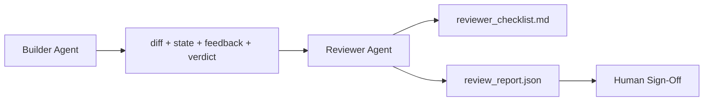

# 评审代理：将构建者与标记员分离

> 编写代码的代理不能对其打分。评审员是具有不同系统提示、不同目标的第二层循环，并对构建者产生的所有内容具有只读访问权限。构建者与评审员之间的差距是大多数可靠性的来源。

**类型：** 构建
**语言：** Python（标准库）
**先决条件：** 阶段 14 · 38（验证关口）
**时间：** 约 55 分钟

## 学习目标

- 说明为什么同一个代理无法可靠地评审其自身工作。
- 构建一个评审代理循环，该循环消费构建者产物并生成结构化评审报告。
- 编写一份评审评分表，对具体维度而非感觉进行评分。
- 将评审员接入工作台，使人工评审步骤从一个真实产物开始。

## 问题陈述

你让代理修复一个错误。它编辑了四个文件，运行了测试，并报告完成。验证关口（阶段 14 · 38）确认验收已运行且范围保持不变。关口说 `passed: true`。你进行了合并。两天后，你发现该修复只解决了错误的一半。

验收是必要但不充分的。评审员会问验收无法提出的问题：这解决了正确的问题吗？它是否在未标记的情况下扩展了范围？它是否记录了本应被质疑的假设？它是否将工作台置于下一个会话可以继续的状态？

## 概念



### 评审员评分表

五个维度，每个维度得分 0 到 2 分。

| 维度       | 问题                                         |
|------------|----------------------------------------------|
| 问题契合度 | 更改是否解决了陈述的任务，而不是一个相近的任务？ |
| 范围纪律   | 编辑是否局限于契约内，还是契约被刻意扩展了？   |
| 假设       | 所有隐藏的假设是否都记录在某个可评审的地方？   |
| 验证质量   | 验收命令是否实际证明了目标，还是只证明了一个较弱版本？ |
| 交接准备度 | 下一个会话是否可以从当前状态顺利接手？         |

满分 10 分。低于 7 分是软失败；低于 5 分是硬失败。

### 评审员是一个独立角色，而非独立模型

你可以使用与构建者相同的模型来运行评审员。纪律在于角色分离：不同的系统提示、不同的输入、对差异没有写入权限。姿态的改变就是信号的改变。

### 评审员不能编辑差异

评审员读取差异、状态、反馈、判定。它撰写报告。它不修补差异。如果报告说“修复这个”，则下一个构建者回合执行修复；评审员回去继续评审。混合角色会消除差距。

### 评审员评分表与验证关口

关口（阶段 14 · 38）检查确定性事实：验收是否运行、规则是否通过、范围是否保持。评审员进行定性判断：这是否是正确的工作、是否有文档记录、交接是否可用。两者都是必需的。

## 构建它

`code/main.py` 实现了：

- 一个 `ReviewerInputs` 数据类，捆绑了评审员读取的产物。
- 一个评分表计分器，每个维度一个函数。每个函数都是确定性的，对于本课来说是存根级别的；真实实现会调用一个 LLM。
- 一个 `review_report.json` 编写器，包含五个分数、总分和一个判定（`pass`、`soft_fail`、`hard_fail`）。
- 两个演示案例：一个干净的更改和一个“测试正确，问题错误”的更改。

运行它：

```
python3 code/main.py
```

输出：写入磁盘的两份评审报告，以及一个控制台维度分数表。

## 业界的生产模式

证据：Cloudflare 2026 年 4 月的 AI 代码评审系统在 30 天内运行了 131,246 次评审，覆盖 48,095 个合并请求，分布在 5,169 个仓库中。中位评审在 3 分 39 秒内完成。最多七个专业评审员（安全、性能、代码质量、文档、发布管理、合规性、工程法典）在一个评审协调器下并行运行，该协调器负责去重发现并判断严重性。顶级模型专门保留给协调器；专业评审员运行在更便宜的层级上。

四种模式使这能够在规模上运作。

**专家池，而非一个大评审员。** 一个具有 5 维度评分表的评审员适用于单人仓库。一旦代码库具有安全关键、性能关键和文档表面，就拆分为具有较小提示的专业员。协调器进行去重；专业评审员从不运行完整评分表。模型层级分离随之而来：便宜的专业员，昂贵的协调器。

**偏见缓解作为设计要求，而非优化。** LLM 评委表现出四种可靠偏见（Adnan Masood，2026 年 4 月）：位置偏见（GPT-4 在 (A,B) 与 (B,A) 排序上约 40% 不一致）、冗长偏见（对更长输出的评分膨胀约 15%）、自我偏好（评委偏爱来自同一模型家族的输出）、权威性（评委对引用已知作者的评价过高）。缓解措施：评估两种排序，只计算一致的胜利；使用明确奖励简洁性的 1-4 分量表；跨模型家族轮换评委；在评分前剥离作者姓名。

**校准集，而非感觉。** 一个 10-20 个任务的历史集合，具有已知的正确判定。每次更改提示后，在其上运行评审员。如果与历史记录的一致性低于 80%，则评分表在评审员发布前需要修改。这是每个团队最终都会重新发现的；最好从一开始就拥有它。

**与关口的混合规范。** 验证关口（阶段 14 · 38）处理确定性检查（验收是否运行、测试是否通过、范围是否保持）。评审员处理语义检查（这是否是正确的工作、假设是否有文档记录、交接是否可用）。Anthropic 2026 年的指导明确提到了这种划分：不要让评审员重做关口已经证明的事情。

## 使用它

生产模式：

- **Claude 子代理。** 一个评审员子代理在构建者关闭任务后运行。它在 PR 上发布带有评分表分数的评论。
- **OpenAI Agents SDK 交接。** 构建者在任务完成时移交给评审员。评审员可以带着一份发现列表或交还给人工。
- **双模型配对。** 构建者运行在更快更便宜的模型上。评审员运行在更强但上下文更小的模型上，专注于判断。

评审员是当人类无法自行进行每项评审时，工作台发展出的第二双眼睛。

## 发布它

`outputs/skill-reviewer-agent.md` 会生成一个项目特定的评审员评分表、一个连接到构建者产物的评审员代理存根，以及与验证关口的集成，使人工评审从一份书面报告开始，而不是空白页面。

## 练习

1.  添加一个针对你产品领域的第六个维度。论证为何它不被现有的五个维度所吸收。
2.  使用两个不同的系统提示（简洁、冗长）运行评审员。哪个生成的报告人类更可能阅读？
3.  为每个维度添加一个 `confidence` 字段。当最低维度的信心低于 0.6 时，拒绝发布报告。
4.  构建一个校准集：10 个具有已知正确判定的历史任务结束情况。在其上运行评审员。它与历史记录在哪里存在分歧？
5.  添加一个“请求更多证据”的功能：评审员可以在评分前要求构建者进行一次特定的测试运行。合适的退避策略是什么，以避免循环？

## 关键术语

| 术语       | 人们所说      | 它实际的意思                                      |
|------------|--------------|--------------------------------------------------|
| 评审员评分表 | "检查清单"    | 五维度 0-2 分评分，每个维度有一个书面问题        |
| 软失败      | "需要修改"    | 总分低于 7 分；构建者获得要解决的发现             |
| 硬失败      | "拒绝"       | 总分低于 5 分或任何维度为 0 分；停止并提交给人类 |
| 角色分离    | "不同的提示"  | 同一个模型可以同时扮演两个角色；纪律在于输入和姿态 |
| 信心下限    | "不发布低信号报告" | 当评分表不确定时，拒绝输出判定 |

## 延伸阅读

- [OpenAI Agents SDK 交接](https://platform.openai.com/docs/guides/agents-sdk/handoffs)
- [Anthropic Claude 子代理](https://docs.anthropic.com/en/docs/agents-and-tools/claude-code/sub-agents)
- [Cloudflare, 大规模编排 AI 代码评审](https://blog.cloudflare.com/ai-code-review/) — 7 专家 + 协调器架构，131k 次运行 / 30 天
- [代理即评委：使用代理评估代理 (OpenReview / ICLR)](https://openreview.net/forum?id=DeVm3YUnpj) — DevAI 基准测试，366 个层次化解决方案需求
- [Adnan Masood, 基于评分表的评估和 LLM 即评委：方法论、偏见、实证验证](https://medium.com/@adnanmasood/rubric-based-evals-llm-as-a-judge-methodologies-and-empirical-validation-in-domain-context-71936b989e80) — 4 种偏见及缓解措施
- [MLflow, LLM 即评委评估](https://mlflow.org/llm-as-a-judge) — 分离构建者/评估器的生产工具
- [LangChain, 如何使用人工更正校准 LLM 即评委](https://www.langchain.com/articles/llm-as-a-judge) — 校准集工作流
- [Evidently AI, LLM 即评委：完整指南](https://www.evidentlyai.com/llm-guide/llm-as-a-judge)
- [Arize, LLM 即评委 — 入门与预制评估器](https://arize.com/llm-as-a-judge/)
- 阶段 14 · 05 — 自我精炼与 CRITIC（单代理自我评审基线）
- 阶段 14 · 30 — 评估驱动的代理开发（校准集生成器）
- 阶段 14 · 38 — 评审员读取的验证关口
- 阶段 14 · 40 — 评审员报告馈送的交接包