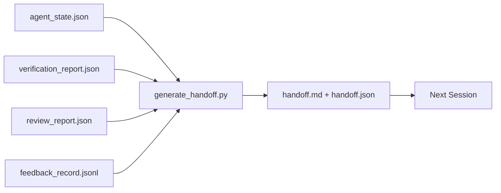

# 多会话交接

> 会话即将结束，但工作并未终止。交接数据包是将"智能体工作了一小时"转化为"下一分钟新会话即刻高效运行"的关键产物。应有意识地构建它，而非事后补救。

**类型：** 构建  
**语言：** Python（标准库）  
**前置条件：** Phase 14 · 34（仓库记忆），Phase 14 · 38（验证），Phase 14 · 39（审查员）  
**时间：** ~50分钟

## 学习目标

- 识别每个交接数据包必需的七个字段。
- 无需手动撰写文案，即可从工作台工件生成交接文档。
- 将大量反馈日志精简为交接适用的摘要。
- 确保下一会话的首个操作具有确定性。

## 问题所在

会话结束时，智能体说："很好，我们取得了进展。"下一会话开始时，新的智能体问："我们上次停在哪里？"而第一个智能体的回答已不复存在。新智能体需要重新探索、重新运行相同命令、重新询问用户相同的问题，浪费三十分钟来恢复上一个会话最后三十秒的内容。

一次糟糕交接的代价将在任务整个生命周期的每次会话中持续付出。解决方案是在会话结束时自动生成一个数据包：记录了哪些更改、为何更改、尝试了哪些方案、哪些方案失败、遗留了什么问题、下次首要行动是什么。

## 核心概念



### 每个交接必需的七个字段

| 字段 | 解答的问题 |
|------|------------|
| `summary` | 用一段话总结已完成的工作 |
| `changed_files` | 快速查看的差异摘要 |
| `commands_run` | 实际执行了哪些操作 |
| `failed_attempts` | 尝试了哪些方案及其失败原因 |
| `open_risks` | 可能在下一会话引发问题的隐患及其严重性 |
| `next_action` | 下一会话采取的第一个具体步骤 |
| `verdict_pointer` | 验证报告和审查报告的路径 |

`next_action` 字段是核心承载功能。一份包含除 `next_action` 以外所有字段的交接文档，只是一份状态报告，而非真正的交接文档。

### 交接是生成的，而非手写的

手写的交接在忙碌的日子里往往会被跳过。生成器读取工作台工件并输出数据包。智能体的职责是让工作台保持生成器可总结的状态，而不是亲自撰写摘要。

### 两种形式：人类可读与机器可读

`handoff.md` 是供人类阅读的版本。`handoff.json` 是供下一个智能体加载的版本。两者均源自同一套源工件。若二者不一致，以 JSON 版本为准。

### 反馈日志精简

完整的 `feedback_record.jsonl` 可能包含数百条记录。交接数据包仅包含最后 K 条记录以及所有非零退出码的条目。下一会话在需要时会加载完整日志，但数据包保持精简。

## 动手构建

`code/main.py` 实现了以下功能：

- 一个加载器，将状态、判定、审查和反馈汇集到单个 `WorkbenchSnapshot` 中。
- 一个 `generate_handoff(snapshot) -> (markdown, payload)` 函数。
- 一个过滤器，选取最后 K 条反馈记录及所有非零退出记录。
- 一个演示运行，将 `handoff.md` 和 `handoff.json` 写入脚本同目录下。

运行它：

```
python3 code/main.py
```

输出：一个打印出来的交接主体内容，以及磁盘上的两个文件。

## 现实生产模式

Codex CLI、Claude Code 和 OpenCode 各自采用了不同的压缩策略；结构化的交接数据包在此三者之上构建。

**压缩策略各异，数据包模式保持一致。** Codex CLI 的 `POST /v1/responses/compact` 是服务端不透明的 AES 加密数据块（适用于 OpenAI 模型的快速路径）；后备方案是将本地生成的"交接摘要"作为 `_summary` 用户角色消息追加。Claude Code 在上下文使用率达 95% 时运行五阶段渐进式压缩。OpenCode 采用基于时间戳的消息隐藏加上一个 5 标题的 LLM 摘要。三种不同机制，同一需求：将压缩后存续的内容序列化为可移植的工件。该数据包正是此工件。

**新会话交接并非压缩。** 压缩是为了延续当前会话；而交接是为了干净利落地结束一个会话，并开始下一个。Hermes Issue #20372 的框架（2026年4月）是正确的：当原地压缩开始导致质量下降时，智能体应写入一份紧凑的交接文档，结束会话，并在新的上下文中恢复。该数据包使得这种过渡成本低廉。错误的做法是持续压缩直到质量崩溃；解决方案是提前规划一次干净的交接。

**每个分支和主题只有一个活跃交接。** 多智能体协作在过时的交接上比在糟糕的模型输出上更容易失败。务必包含 `branch`、`last_known_good_commit` 和一份 `status`（关于 `active | superseded | archived`）。过时的交接应被归档；只有活跃的交接驱动下一会话。这就是“交接作为笔记”与“交接作为状态”的区别。

**在上下文用量达到 50-75% 时收尾，而非耗尽时。** 手写模式手册（CLAUDE.md + HANDOVER.md）报告在上下文预算达到 50-75% 时结束会话（而非 95%）效果最佳。数据包生成器在压缩伪迹污染源状态之前能干净地运行。在上下文完整时轻松写入；在模型已开始“迷糊”时则代价高昂。

## 使用它

生产模式：

- **会话结束钩子。** 运行时在用户关闭聊天时触发生成器。数据包被存入 `outputs/handoff/<session_id>/`。
- **PR 模板。** 生成器的 Markdown 输出也可作为 PR 的正文。审查者无需打开其他五个文件即可阅读。
- **跨智能体交接。** 使用一种产品（Claude Code）构建，换用另一种产品（Codex）继续。该数据包是通用语言。

数据包体积小、格式规整、生成成本低。其带来的成本节省随每次会话累积。

## 发布它

`outputs/skill-handoff-generator.md` 会生成一个针对项目工件路径调整过的生成器，一个在会话结束时运行它的钩子，以及一个 `handoff.json` 模式，供下一个智能体启动时读取。

## 练习

1. 添加一个 `assumptions_to_validate` 字段，用于呈现构建者记录但审查员评分未高于1的所有假设。
2. 针对失败运行与通过运行，采用不同的方式精简反馈摘要。并论证这种差异性的合理性。
3. 包含一个“给用户的问题”列表。一个问题进入数据包而非聊天消息的阈值是什么？
4. 使生成器具有幂等性：运行两次应产生相同的数据包。需要哪些条件保持稳定才能实现这一点？
5. 添加一个“下一会话前提条件”部分，精确列出下一会话在行动前必须加载的工件。

## 关键术语

| 术语 | 常见说法 | 实际含义 |
|------|----------|----------|
| 交接数据包 | "会话摘要" | 携带七个字段的生成工件，同时包含 Markdown 和 JSON 格式 |
| 下一个行动 | "首先该做什么" | 启动下一会话的那一个具体步骤 |
| 反馈精简 | "日志摘要" | 最后 K 条记录加上所有非零退出码的记录 |
| 状态报告 | "我们做了什么" | 缺失 `next_action` 的文档；有用，但不是交接 |
| 判定指针 | "收据" | 验证报告和审查报告的路径，用于追溯性 |

## 延伸阅读

- [Anthropic，长时运行智能体的有效运行框架](https://www.anthropic.com/engineering/effective-harnesses-for-long-running-agents)
- [OpenAI Agents SDK 交接](https://platform.openai.com/docs/guides/agents-sdk/handoffs)
- [Codex 博客，Codex CLI 上下文压缩：架构、配置、管理长会话](https://codex.danielvaughan.com/2026/03/31/codex-cli-context-compaction-architecture/) — POST /v1/responses/compact 与本地后备方案
- [Justin3go，卸下沉重记忆：Codex、Claude Code、OpenCode 中的上下文压缩](https://justin3go.com/en/posts/2026/04/09/context-compaction-in-codex-claude-code-and-opencode) — 三家供应商压缩机制对比
- [JD Hodges，Claude 交接提示：如何跨会话保持上下文（2026）](https://www.jdhodges.com/blog/ai-session-handoffs-keep-context-across-conversations/) — CLAUDE.md + HANDOVER.md，50-75% 上下文预算
- [Mervin Praison，管理多智能体编码会话中的交接：保持连续性的新上下文](https://mer.vin/2026/04/managing-handoffs-in-multi-agent-coding-sessions-fresh-context-without-losing-continuity/) — 分布式系统框架
- [Hermes Issue #20372 — 当压缩变得有风险时自动进行新会话交接](https://github.com/NousResearch/hermes-agent/issues/20372)
- [Hermes Issue #499 — 上下文压缩质量大修](https://github.com/NousResearch/hermes-agent/issues/499) — Codex CLI 中的交接导向提示
- [微软智能体框架，压缩](https://learn.microsoft.com/en-us/agent-framework/agents/conversations/compaction)
- [OpenCode，上下文管理与压缩](https://deepwiki.com/sst/opencode/2.4-context-management-and-compaction)
- [LangChain，智能体的上下文工程](https://www.langchain.com/blog/context-engineering-for-agents)
- Phase 14 · 34 — 生成器读取的状态文件
- Phase 14 · 38 — 数据包指向的验证判定结果
- Phase 14 · 39 — 打包到数据包中的审查员报告