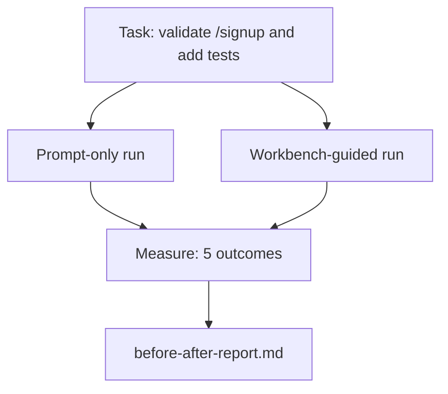

# 真实代码库中的工作台实践

> 如果无法在实际代码库中经受考验，十一堂表面课程便毫无价值。本课将在一个小型示例应用上运行同一任务两次：仅使用提示 vs 工作台引导。数据说明一切。

**类型：** 实践构建  
**语言：** Python (标准库)  
**前置课程：** 阶段 14·32 至 14·40  
**时间：** 约60分钟

## 学习目标

- 将七个工作台表面整合应用于小型应用程序
- 运行同一任务两次（仅提示 vs 工作台引导）并衡量五项结果
- 阅读前后对比报告，判断哪些表面最具杠杆效应
- 应对“但我的模型已经足够好”的质疑

## 问题所在

玩具任务的演示无法说服任何人。工作台的价值体现在：当真实感任务在真实感代码库中落地时，能带来更少的失败、更少的回滚，以及下一阶段可复用的数据包。

本课将呈现该真实感代码库，并通过两条流程运行同一任务。最终你将获得一份可供说服怀疑者的对比报告。

## 核心概念



### 示例应用

`sample_app/`中的极简FastAPI风格处理器：

- `app.py`配合`/signup`（暂无验证）
- `test_app.py`包含一个正常路径测试
- `README.md`和`scripts/release.sh`作为禁止区域诱饵

### 目标任务

> 为`/signup`添加输入验证：拒绝短于8位的密码，返回422状态码及类型化错误信封。添加测试以验证新行为。

### 两条流程对比

仅提示流程：
1. 阅读README文档
2. 阅读`app.py`
3. 编辑文件
4. 声称完成

工作台引导流程：
1. 运行初始化脚本（课程35）
2. 阅读范围契约（课程36）
3. 阅读状态信息（课程34）
4. 仅编辑允许的文件
5. 通过反馈运行器执行验收命令（课程37）
6. 运行验证门禁（课程38）
7. 运行审查器（课程39）
8. 生成交接文档（课程40）

### 衡量的五项结果

| 结果指标 | 重要性说明 |
|---------|------------|
| `tests_actually_run` | 大多数“测试通过”的声明无法验证 |
| `acceptance_met` | 证明目标的测试必须是实际运行的测试 |
| `files_outside_scope` | 范围蔓延是主要的隐性失败原因 |
| `handoff_quality` | 下一阶段会为此付出代价或受益 |
| `reviewer_total` | 在门禁基础上的定性判断 |

## 构建实现

`code/main.py`针对相同示例应用装置协调两条流程。两条流程均已脚本化（无LLM参与），确保测量可复现。脚本将对比结果写入`before-after-report.md`和`comparison.json`。

执行命令：

```
python3 code/main.py
```

输出内容：控制台显示每条流程的结果表格，markdown报告保存在脚本旁，JSON数据供需要图表化的人使用。

## 实际生产模式

怀疑者会问“工作台到底有多大帮助？”2026年的数据比解释更有说服力。

**同一模型下，终端测试排名从Top-30升至Top-5。** LangChain的《Agent Harness解析》（2026年4月）显示：仅通过改变运行框架，编程Agent在Terminal Bench 2.0测试中从30名开外跃升至第5位。相同模型，不同表面，25个排名的差距。

**Vercel通过删除工具实现80%到100%的提升。** Vercel报告删除80%的Agent工具后，成功率从80%提升至100%。更小的工具表面、更精确的范围、更少的失败路径。负空间获胜。

**仅通过框架优化，Harvey实现2倍准确率提升。** 法律Agent通过框架优化将准确率提高一倍以上，无需更改模型。

**88%的企业AI Agent项目未能投产。** preprints.org的《语言Agent的框架工程》论文（2026年3月）将失败归因于运行时而非推理能力：过时状态、脆弱的重试机制、过度膨胀的上下文、从中间错误恢复能力差。

**长上下文失效。** WebAgent基线40-50%的成功率在长上下文条件下降至10%以下，主要源于无限循环和目标丢失。Ralph Loop和交接数据包正是为此而设计。

**假阴性依然存在。** 单步事实性任务、单行代码检查、格式化运行、任何模型已逐字记忆的任务——仅提示流程运行更快。基准测试应诚实列举这些情况，避免将工作台框架过度设计。

关键启示并非“框架永远胜利”。模型会随时间吸收框架技巧。核心在于：当前工程负载集中在七个表面上，数据已证明这一点。

## 实际应用

本课是以下场景的案例依据：

- 当有人质疑为何每个PR都携带`agent-rules.md`和范围契约时
- 当团队想“仅在这个冲刺周期”移除验证门禁时
- 当新Agent产品发布，需要可移植基准评估其是否真正节省时间时

数据比解释更具传播力。

## 交付成果

`outputs/skill-workbench-benchmark.md`是可移植的评估框架，能针对项目的示例应用运行任何Agent产品通过两条流程，并报告五项结果。

## 练习

1. 增加第六项结果：首次有效编辑时间。如何干净地测量它？
2. 在代码库的真实次日任务上运行对比。工作台数据何时会出现偏差？
3. 增加“假阴性”测试轮次：仅提示流程更快且工作台开销构成实际成本的任务。论证仍保留工作台的必要性。
4. 用真实LLM调用替换脚本化的“Agent”。哪些结果会变得更嘈杂？
5. 撰写面向非工程师的单页摘要。哪些内容能通过筛选？

## 核心术语

| 术语 | 常见说法 | 实际含义 |
|------|----------|----------|
| 示例应用 | “玩具仓库” | 小型但足够真实，能完整测试所有七个表面 |
| 流程 | “工作流” | Agent遵循的有序表面读写序列 |
| 前后对比报告 | “凭证” | 提供给怀疑者的论证材料 |
| 假阴性 | “工作台过度设计” | 仅提示流程更快的任务；需诚实列举以评估 |
| 工作台基准 | “可靠性评分” | 可在你代码库上运行对比的可移植框架 |

## 延伸阅读

- [LangChain《Agent Harness解析》](https://blog.langchain.com/the-anatomy-of-an-agent-harness/) — 终端测试Top-30到Top-5的实证
- [MongoDB《Agent Harness：为什么LLM是Agent系统中最小的部分》](https://www.mongodb.com/company/blog/technical/agent-harness-why-llm-is-smallest-part-of-your-agent-system) — Vercel + Harvey数据
- [preprints.org《语言Agent的框架工程》](https://www.preprints.org/manuscript/202603.1756) — 88%企业失败率，运行时根因分析
- [HN：一个下午改进15个LLM的编程能力。仅改变框架](https://news.ycombinator.com/item?id=46988596) — 在15个模型上复现
- [Cloudflare《大规模编排AI代码审查》](https://blog.cloudflare.com/ai-code-review/) — 生产环境30天13.1万次审查运行
- [Anthropic《构建高效Agent》](https://www.anthropic.com/research/building-effective-agents)
- 阶段 14·32 至 14·40 — 本课端到端测试的表面
- 阶段 14·19 — SWE-bench、GAIA、AgentBench作为本课补充的宏观基准
- 阶段 14·30 — 评估驱动的Agent开发，同一框架的集成点