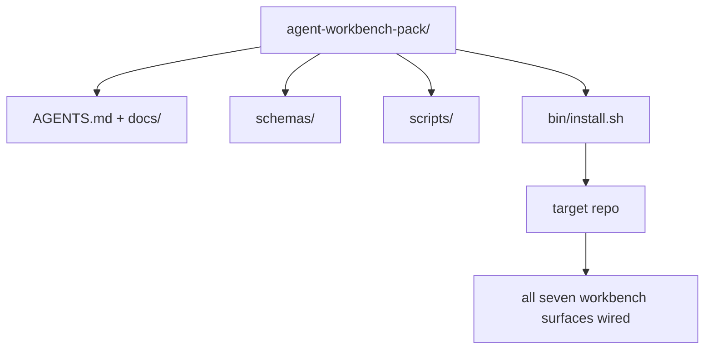

# 毕业项目：打包可复用的代理工作台工具包

> 本微课程结束时，你将拥有一个可投入任何代码仓库的工具包。十一节课的知识被压缩成一个`cp -r`，第二天早上就能让一个代理稳定运行。这个毕业项目是本课程成果的核心体现。

**类型：** 构建
**语言：** Python（标准库）
**先决条件：** 第14.31至14.41节
**时间：** 约75分钟

## 学习目标

- 将七个工作台界面打包到一个即插即用的目录中。
- 锁定模式、脚本和模板，使新代码仓库能获得一个已知良好的基准。
- 添加一个单一的安装脚本，以幂等方式部署工具包。
- 决定哪些内容应包含在工具包内，哪些应排除在外，并为每个决定进行辩护。

## 问题

一个存在于谷歌文档、聊天记录和三个记不清的脚本中的工作台，是一个每个季度都需要重新构建的工作台。解药是一个版本化的工具包：一个包含界面、模式、脚本和一个单命令安装程序的代码仓库或目录。

本课结束时，你将拥有`outputs/agent-workbench-pack/`部署在磁盘上，以及一个`bin/install.sh`，可以将它放入任何目标代码仓库。

## 核心概念



### 工具包布局

```
outputs/agent-workbench-pack/
├── AGENTS.md
├── docs/
│   ├── agent-rules.md
│   ├── reliability-policy.md
│   ├── handoff-protocol.md
│   └── reviewer-rubric.md
├── schemas/
│   ├── agent_state.schema.json
│   ├── task_board.schema.json
│   └── scope_contract.schema.json
├── scripts/
│   ├── init_agent.py
│   ├── run_with_feedback.py
│   ├── verify_agent.py
│   └── generate_handoff.py
├── bin/
│   └── install.sh
└── README.md
```

### 包含与排除

**包含：**

- 界面模式。它们是契约。
- 上述四个脚本。它们是运行时。
- 四份文档。它们是规则和评估标准。

**排除：**

- 项目特定的任务。任务属于目标代码仓库的任务板，而非工具包。
- 供应商SDK调用。工具包与框架无关。
- 入门指南。工具包与团队现有的入门材料并列，而非嵌入其中。

### 安装程序

一个简短的`bin/install.sh`（或`bin/install.py`）：

1. 拒绝在未获得`--force`的情况下覆盖现有工具包。
2. 将工具包复制到目标代码仓库。
3. 如果存在`.github/workflows/`，则配置CI。
4. 打印后续步骤：填充任务板、设置验收命令、运行初始化脚本。

### 版本控制

工具包携带一个`VERSION`文件。需要迁移的模式或脚本变更会触发主版本号更新。仅文档变更会触发补丁版本号更新。目标代码仓库的`agent_state.json`会记录它初始化时所针对的工具包版本。

## 动手构建

`code/main.py`将工具包组装到课程旁边的`outputs/agent-workbench-pack/`中，其中包含了本微课程前序课程的模式、脚本以及你已经编写的文档。

运行它：

```
python3 code/main.py
```

该脚本会复制并固定界面，写入README，打印工具包目录树，并以状态码0退出。重复运行是幂等的。

## 生产环境的实际模式

一个工具包只有在它能经受分支、更新和不友好的上游变动时才具有价值。以下四种模式可以实现这一点。

**`VERSION`是契约，不是宣传材料。** 主版本号更新需要状态迁移。次版本号更新需要重新运行检查器。补丁版本号更新仅涉及文档。安装程序每次安装时都会将`.workbench-version`写入目标代码仓库；`lint_pack.py`会在目标锁定文件与工具包的`VERSION`不一致时拒绝部署。这就是`npm`、`Cargo`和`pyproject.toml`能够存活10年迭代的原因；代理相关的改变并未改变这些规则。

**跨工具分发的单一来源。** Nx从一个单一的`nx ai-setup`出发，能部署`AGENTS.md`、`CLAUDE.md`、`.cursor/rules/`、`.github/copilot-instructions.md`以及一个MCP服务器。工具包也应该这样做；安装程序发出符号链接(`ln -s AGENTS.md CLAUDE.md`)，以便单一事实来源能够分发给每个编码代理。为支持某个特定工具而分叉工具包是一种失败模式。

**`uninstall.sh`拒绝在非平凡状态下操作。** 卸载工具包不得删除用户的`agent_state.json`、`task_board.json`或`outputs/`。卸载程序会移除模式、脚本、文档和`AGENTS.md`（提供`--keep-agents-md`选项），如果状态文件有任何未提交的更改，将拒绝继续。状态属于用户；工具包并不拥有它。

**技能即发布物。SkillKit风格分发。** 工具包以SkillKit技能的形式发布：`skillkit install agent-workbench-pack`可以从单一来源将其部署到32个AI代理。工具包代码仓库是事实来源；SkillKit是分发渠道。供应商锁定不复存在；七个界面保持不变。

## 使用它

工具包发布的三个地方：

- **作为你放入代码仓库的目录。** `cp -r outputs/agent-workbench-pack /path/to/repo`。
- **作为公开的模板仓库。** 分叉并自定义，通过`VERSION`控制漂移。
- **作为SkillKit技能。** 集成到你的代理产品中，一个命令即可部署。

工具包是配方。每次安装都是一份餐点。

## 发布它

`outputs/skill-workbench-pack.md`会生成一个针对项目调优的工具包：规则根据团队历史进行了细化，范围匹配模式适配代码仓库，评估标准维度扩展了一项领域特定的条目。

## 练习

1.  决定哪份可选的第五份文档值得提升到标准工具包中。为你的选择辩护。
2.  将安装程序重写为带有`--dry-run`标志的Python脚本。对比其与bash脚本的易用性。
3.  添加一个`bin/uninstall.sh`，能安全地移除工具包，并在状态文件有非平凡历史时拒绝执行。什么算作非平凡？
4.  添加一个`lint_pack.py`，当工具包从`VERSION`漂移时失败。将其接入工具包自身代码仓库的CI。
5.  编写从手工作业台迁移到此工具包的运维手册。最小化停机时间的操作顺序是什么？

## 关键术语

| 术语 | 常见说法 | 实际含义 |
|------|----------|----------|
| 工作台工具包 | “入门套件” | 一个包含所有七个界面的版本化目录 |
| 安装程序 | “安装脚本” | `bin/install.sh`，用于幂等部署工具包 |
| 工具包版本 | “VERSION” | 模式/脚本变更时主版本号升级，仅文档变更时补丁版本号升级 |
| 即插即用工具包 | “复制并运行” | 工具包第一天即可工作，无需针对每个代码仓库进行定制 |
| 可分叉模板 | “GitHub模板” | 可供GitHub的“使用此模板”功能克隆的公开仓库 |

## 延伸阅读

- 第14.31至14.41节 — 本工具包捆绑的所有界面
- [SkillKit](https://github.com/rohitg00/skillkit) — 将此技能安装到32个AI代理中
- [Nx博客, 教你的AI代理如何在Monorepo中工作](https://nx.dev/blog/nx-ai-agent-skills) — 跨六个工具的单一来源生成器
- [agents.md — 开放规范](https://agents.md/) — 你的工具包路由器必须实现的内容
- [HKUDS/OpenHarness](https://github.com/HKUDS/OpenHarness) — 等同于工具包的参考实现
- [andrewgarst/agentic_harness](https://github.com/andrewgarst/agentic_harness) — 带评估套件的Redis后端参考实现
- [Augment Code, 好的AGENTS.md是一次模型升级](https://www.augmentcode.com/blog/how-to-write-good-agents-dot-md-files) — 工具包文档质量基准
- [Anthropic, 长时间运行代理的有效工具框架](https://www.anthropic.com/engineering/effective-harnesses-for-long-running-agents)
- [Anthropic, 用于长时间运行应用开发的工具框架设计](https://www.anthropic.com/engineering/harness-design-long-running-apps)
- 第14.30节 — 使用工具包验证门的评估驱动代理开发
- 第14.41节 — 本工具包所改进的前后基准测试